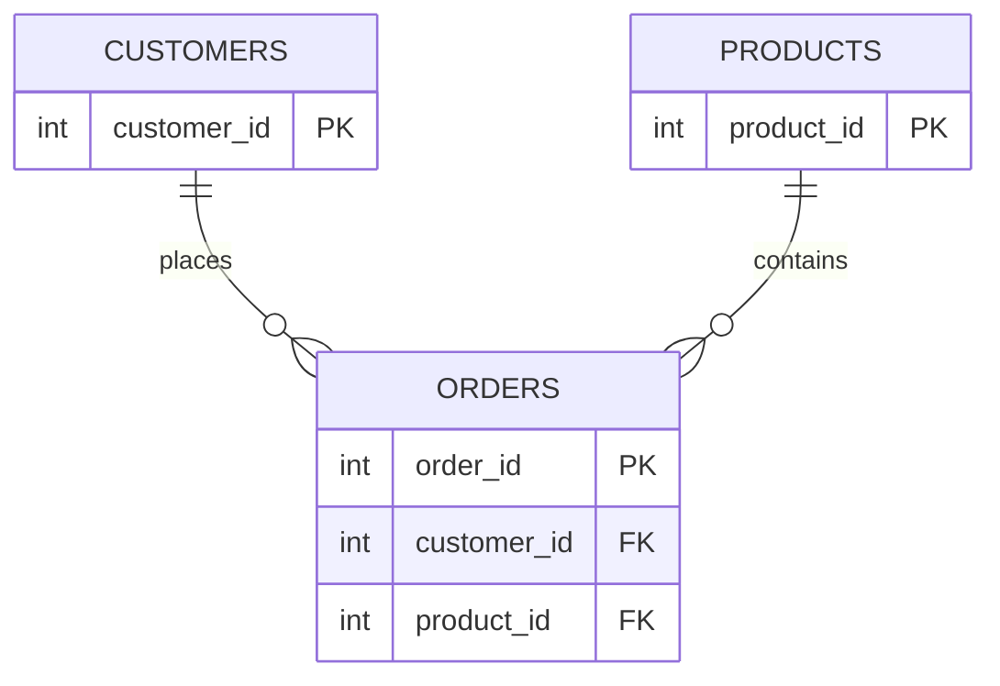

# Data Model

Medallion schemas for the e-commerce sales pipeline. Logical types use Spark/Delta-friendly names.
Physical table names follow `bronze_*`, `silver_*`, `gold_*` under a configurable catalog/schema (see `database/schema.sql`).

**Naming:** All column names use **snake_case** in CSV headers, Bronze, Silver, and Gold (e.g. `customer_id`, `order_date`). Same names in `requirements-analysis.md` and Silver requirements (SV-*).

**Row counts (exact):** 10,000 customers, 100,000 orders, 500 products per file before intentional defects alter uniqueness counts as documented below.

**Gold eligibility (CL-04, CL-05):** Only Silver rows with `quality_check_result` = `PASS` feed Gold. Rows that fail any check — including **duplicate primary keys** — stay in Silver for audit but are **not** used in Gold aggregations.

**Out of scope here:** DQ rule expressions and business-logic predicates (`data-quality-strategy.md`); segmentation numeric cutoffs from sample order value (`design-notes.md`, CL-03).

---

## Relationships

- **customers** → **orders** via `customer_id`
- **products** → **orders** via `product_id`
- Gold builds from **PASS** Silver orders joined to **PASS** Silver customers/products where needed.
- Gold **customer_segmentation** uses behavior `segment_type` (High-Value / Repeat / One-Time / Inactive), not source `customer_segment` (Premium / Standard / Basic).

---

## Source (CSV)

Files: `data/customers.csv`, `data/orders.csv`, `data/products.csv`.

| File | Target row count |
|---|---:|
| `customers.csv` | 10,000 |
| `orders.csv` | 100,000 |
| `products.csv` | 500 |

### `customers.csv`

| Column | Type | PK/FK | Nullable | Domain / notes |
|---|---|---|---|---|
| `customer_id` | INT | PK | No | |
| `customer_name` | STRING | | No | |
| `email` | STRING | | Yes | 50 intentional NULLs |
| `country` | STRING | | No | |
| `signup_date` | DATE | | No | |
| `customer_segment` | STRING | | No | `Premium`, `Standard`, `Basic` |
| `lifetime_value` | DECIMAL(18,2) | | No | Source attribute; not Gold `lifetime_value_actual` |

### `orders.csv`

| Column | Type | PK/FK | Nullable | Domain / notes |
|---|---|---|---|---|
| `order_id` | INT | PK | No | 20 intentional duplicate keys |
| `customer_id` | INT | FK → customers | Yes | 100 intentional NULLs; 50 orphan IDs |
| `order_date` | DATE | | No | |
| `product_id` | INT | FK → products | Yes | 200 intentional NULLs; 30 orphan IDs |
| `quantity` | INT | | No | |
| `unit_price` | DECIMAL(18,2) | | No | |
| `total_amount` | DECIMAL(18,2) | | No | Primary **order value** for segmentation (CL-03) |
| `order_status` | STRING | | No | `Pending`, `Completed`, `Cancelled` |
| `payment_date` | DATE | | Yes | |

### `products.csv`

| Column | Type | PK/FK | Nullable | Domain / notes |
|---|---|---|---|---|
| `product_id` | INT | PK | No | |
| `product_name` | STRING | | No | |
| `category` | STRING | | No | |
| `price` | DECIMAL(18,2) | | No | |
| `cost` | DECIMAL(18,2) | | No | |
| `stock_quantity` | INT | | No | |
| `reorder_level` | INT | | No | |

---

## Bronze

One table per source entity; **business columns match CSV** (plus optional ingest metadata). No cleansing or deduplication (BR-02).

Suggested tables: `bronze_customers`, `bronze_orders`, `bronze_products`.

| Metadata column | Type | Purpose |
|---|---|---|
| `_ingested_at` | TIMESTAMP | Ingestion time (BR-04) |
| `_source_file` | STRING | Optional path/name of source CSV |
| `_ingestion_batch_id` | STRING | Optional; supports reruns |

**Types:** Explicit or inferred types per BR-03 and source contract; Silver type validation enforces the canonical types.

---

## Silver

One validated table per entity: `silver_customers`, `silver_orders`, `silver_products`.

### Business columns

- **customers / products:** Same attributes as source/Bronze; typed per contract after validation.
- **orders:** Same as source/Bronze; FK and amount columns retained; invalid values flagged, not dropped.

### Quality and lineage columns (all Silver entity tables)

| Column | Type | Purpose |
|---|---|---|
| `quality_check_result` | STRING | `PASS` or `FAIL` (record fails if any check fails) |
| `failed_checks` | STRING or ARRAY&lt;STRING&gt; | Categories failed, e.g. `completeness`, `uniqueness`, `referential_integrity`, `type_validation`, `business_logic` |
| `_silver_processed_at` | TIMESTAMP | Optional audit |

Duplicate PK rows: every row in a duplicate group should `FAIL` with `uniqueness` in `failed_checks` (CL-05).

### Validation categories (maps to `src/silver/` scripts)

| Category | Script | Primary entities / columns |
|---|---|---|
| Completeness | `01_quality_completeness.py` | `customers.email`; `orders.customer_id`, `orders.product_id` |
| Uniqueness | `02_quality_uniqueness.py` | `customers.customer_id`; `orders.order_id` |
| Type validation | `03_quality_type_validation.py` | All columns vs types/domains in this document |
| Referential integrity | `04_quality_referential_integrity.py` | `orders.customer_id`, `orders.product_id` → parent Silver tables |
| Business logic | `05_quality_business_logic.py` | Order amounts, quantities, status-related rules (`data-quality-strategy.md`) |

**Quality metrics report (SV-07):** Aggregates pass/fail or % by category above; not a core entity table.

---

## Gold

Four analytic tables. All are built from Silver rows with `quality_check_result` = `PASS` only (CL-04).

### `gold_sales_by_product` (GD-01)

| Column | Type | Description |
|---|---|---|
| `product_id` | INT | |
| `product_name` | STRING | |
| `category` | STRING | |
| `total_orders` | BIGINT | Count of qualifying orders |
| `total_revenue` | DECIMAL(18,2) | Sum of `total_amount` on qualifying orders |
| `avg_order_value` | DECIMAL(18,2) | `total_revenue` / `total_orders` |

### `gold_revenue_by_customer` (GD-02)

| Column | Type | Description |
|---|---|---|
| `customer_id` | INT | |
| `customer_name` | STRING | |
| `customer_segment` | STRING | Source Premium / Standard / Basic |
| `total_orders` | BIGINT | |
| `total_revenue` | DECIMAL(18,2) | |
| `avg_order_value` | DECIMAL(18,2) | |
| `lifetime_value_actual` | DECIMAL(18,2) | Sum of qualifying order `total_amount` for the customer |

### `gold_daily_weekly_trends` (GD-03, CL-01)

| Column | Type | Description |
|---|---|---|
| `period_start` | DATE | Start of day or week |
| `period_grain` | STRING | `DAY` or `WEEK` |
| `total_orders` | BIGINT | Qualifying orders in period |
| `total_revenue` | DECIMAL(18,2) | Sum of `total_amount` in period |

Week boundaries (e.g. ISO vs calendar) defined in `design-notes.md`.

### `gold_customer_segmentation` (GD-04, CL-03)

One row per behavior segment. Customers are assigned `segment_type` from **order value** (e.g. total or average qualifying `total_amount`) using cutoffs tuned to the sample dataset; rules in `design-notes.md`.

| Column | Type | Description |
|---|---|---|
| `segment_type` | STRING | `High-Value`, `Repeat`, `One-Time`, `Inactive` |
| `customer_count` | BIGINT | |
| `avg_revenue` | DECIMAL(18,2) | Mean qualifying revenue per customer in segment |
| `total_revenue` | DECIMAL(18,2) | Sum of qualifying revenue in segment |

---

## Dashboard consumption (CL-06)

All dashboard SQL reads **Gold only**:

| Tile (PRD) | Typical source |
|---|---|
| Top 10 products by revenue | `gold_sales_by_product` |
| Customer revenue distribution | `gold_revenue_by_customer` (or derived bucket query on `total_revenue`) |
| Customer segmentation pie | `gold_customer_segmentation` |

Optional tiles may use `gold_daily_weekly_trends`; still Gold-only.

---

## Remaining implementation notes

| Topic | Where decided |
|---|---|
| Catalog/schema names | `database/schema.sql` |
| Delta vs managed tables | README / setup |
| Type and business-logic predicates | `data-quality-strategy.md` |
| Segmentation order-value cutoffs | `design-notes.md` (CL-03) |
| Week start for trends | `design-notes.md` |
